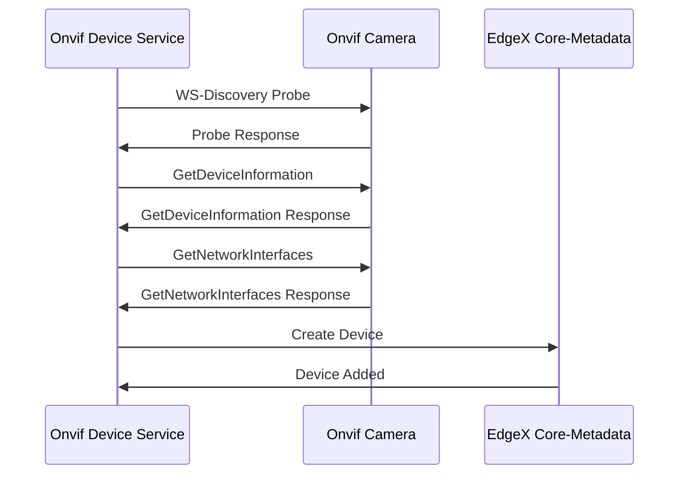

# Auto Discovery
There are two methods that the device service can use to discover and add ONVIF
compliant cameras using WS-Discovery: multicast and netscan.

For more info on how WS-Discovery works, see [here](./ws-discovery.md).


## How To
> **NOTE:** Ensure that the cameras are all installed and configured before attempting discovery.

Device discovery is triggered by the device SDK. Once the device service starts, it will discover the Onvif camera(s) at the specified interval.
> **Note:** You can also manually trigger discovery using this command: `curl -X POST http://<service-host>:59984/api/v2/discovery`


### Step 1. Enable the Discovery Mechanism
> **Note:** This is already enabled by default.

<details>
<summary><strong>via configuration.toml</strong></summary>

Define the following configurations in [cmd/res/configuration.toml](../cmd/res/configuration.toml):

```toml
[Device]
    [Device.Discovery]
    Enabled = true
    Interval = "1h"
```
</details>

<details>
<summary><strong>via Docker / Env Vars</strong></summary>

Define the following environment variables in your `docker-compose.yaml`:
```yaml
device-onvif-camera:
  environment:
    DEVICE_DISCOVERY_ENABLED: "true"
    DEVICE_DISCOVERY_INTERVAL: "1h"
```

</details>

### Step 2. Discovery Configuration

> _See [Configuration Section](#Configuration-Guide) for full details_

> **Note:** Alternatively, for `netscan` you can set the `DiscoverySubnets` automatically
> _after_ the service has been deployed by running the [bin/configure-subnets.sh](./utility-scripts.md#configure-subnetssh) script

<details>
<summary><strong>via configuration.toml</strong></summary>

Define the following configurations in [cmd/res/configuration.toml](../cmd/res/configuration.toml) for auto-discovery mechanism:

```toml
# Custom configs
[AppCustom]
# The target ethernet interface for multicast discovering
DiscoveryEthernetInterface = "eth0"
# The Secret Path of the default credentials to use for devices
DefaultSecretPath = "credentials001"
# Select which discovery mechanism(s) to use
DiscoveryMode = "both" # netscan, multicast, or both
# List of IPv4 subnets to perform netscan discovery on, in CIDR format (X.X.X.X/Y)
# separated by commas ex: "192.168.1.0/24,10.0.0.0/24"
DiscoverySubnets = ""
```
</details>

<details>
<summary><strong>via Docker / Env Vars</strong></summary>

Define the following environment variables in `docker-compose.yaml`:
```yaml
device-onvif-camera:
  environment:
    APPCUSTOM_DISCOVERYETHERNETINTERFACE: "eth0"
    APPCUSTOM_DEFAULTSECRETPATH: "credentials001"
    APPCUSTOM_DISCOVERYMODE: "both"
    APPCUSTOM_DISCOVERYSUBNETS: "192.168.1.0/24"
```
</details>

### Step 3. Set CredentialsMap
<details>
<summary><strong>A: via configuration.toml</strong></summary>

Define the following configurations in [cmd/res/configuration.toml](../cmd/res/configuration.toml):

```toml
# AppCustom.CredentialsMap is a map of SecretPath -> Comma separated list of mac addresses
#
# The special group 'NoAuth' defines mac addresses of cameras where no authentication is to be used. This
# group will cause the code to skip looking in the SecretStore altogether. 'NoAuth' is a special group
# name that does not exist in the SecretStore.
[AppCustom.CredentialsMap]
# Example: (MAC Addresses of devices without credentials)
NoAuth = "ab:bc:cd:de:ff:aa"
# Example: (Single mapping for 1 mac address to 1 credential)
credentials001 = "aa:bb:cc:dd:ee:ff"
# Example: (Multi mapping for 3 mac address to 1 shared credentials)
credentials002 = "11:22:33:44:55:66,ff:ee:dd:cc:bb:aa,ab:12:12:34:34:56:56"
```
</details>

<details>
<summary><strong>B: via utility scripts</strong></summary>

See the full documentation [here](./utility-scripts.md#use-cases).
</details>

## Configuration Guide
### DiscoveryMode
> For docker, set the env var `APPCUSTOM_DISCOVERYMODE`

`DiscoveryMode` allows you to select which discovery mechanism(s) to use. The three options are: `netscan`, `multicast`, and `both`.

#### netscan
`netscan` works by sending unicast UDP [WS-Discovery](./ws-discovery.md) probes to a set of 
IP addresses on the CIDR subnet(s) configured via [`DiscoverySubnets`](#DiscoverySubnets).

For example, if the provided CIDR is `10.0.0.0/24`, it will probe the all IP addresses 
from `10.0.0.1` to `10.0.0.254`. This will result in a total of 254 probes on the network.

This method is a little slower and more network-intensive than multicast WS-Discovery, because it has to 
make individual connections. However, it can reach a much wider set of networks and works 
better behind NATs (such as docker networks).

#### multicast
`multicast` works by sending a single multicast UDP [WS-Discovery](./ws-discovery.md) Probe to the multicast address `239.255.255.250` on port `3702`.
In certain networks this traffic is blocked, and it is also not forwarded across subnets, so it is not compatible with NATs
such as docker networks (except in the case of running an Onvif simulator inside the same docker network).

#### both
This option combines both [netscan](#netscan) and [multicast](#multicast).

### DiscoverySubnets
> For docker, set the env var `APPCUSTOM_DISCOVERYSUBNETS`

This is the list of IPv4 subnets to perform netscan discovery on, in CIDR format (X.X.X.X/Y)
separated by commas ex: "192.168.1.0/24,10.0.0.0/24". This value can be configured automatically via
the [bin/configure-subnets.sh](../bin/configure-subnets.sh) script.

### DiscoveryEthernetInterface
> For docker, set the env var `APPCUSTOM_DISCOVERYETHERNETINTERFACE`

This is the target Ethernet Interface to use for [multicast](#multicast) discovering. Keep in mind this interface
is relative to the environment it is being run under. For example, when running in docker, those interfaces
are different from your host machine's interfaces.

### ProbeAsyncLimit
> For docker, set the env var `APPCUSTOM_PROBEASYNCLIMIT`

This is the maximum simultaneous network probes when running netscan discovery.

### ProbeTimeoutMillis
> For docker, set the env var `APPCUSTOM_PROBETIMEOUTMILLIS`

This is the maximum amount of milliseconds to wait for each IP probe before timing out.
This will also be the minimum time the discovery process can take.

### MaxDiscoverDurationSeconds
> For docker, set the env var `APPCUSTOM_MAXDISCOVERDURATIONSECONDS`

This is the maximum amount of seconds the discovery process is allowed to run before it will be cancelled.
It is especially important to have this configured in the case of larger subnets such as /16 and /8.


## Adding the Devices to EdgeX


### Add Credentials to Unknown Camera
If a camera is discovered in which the credentials are unknown, it will be
added as a generic onvif camera, and will require the user to set the credentials
in order to call most ONVIF commands.

Credentials can be added and modified via [utility scripts](./utility-scripts.md#use-cases)

#### Non-Secure Mode
##### Helper Script
Run the [bin/set-credentials.sh](../bin/set-credentials.sh) script
```shell
# Usage: bin/set-credentials.sh [-s/--secure-mode] [-d <device_name>] [-u <username>] [-p <password>]
bin/set-credentials.sh

# Select which camera by device-name (uuid)
# Enter username when prompted
# Enter password when prompted

```

***

##### Manual
> **Note:** Replace `<device-name>` with the device name of the
> camera you want to set credentials for, `<username>` with the username, and
> `<password>` with the password.

Set Path to `<device-name>`
```shell
curl -X PUT --data "<device-name>" \
    "http://localhost:8500/v1/kv/edgex/devices/2.0/device-onvif-camera/Writable/InsecureSecrets/<device-name>/Path"
```

Set username to `<username>`
```shell
curl -X PUT --data "<username>" \
    "http://localhost:8500/v1/kv/edgex/devices/2.0/device-onvif-camera/Writable/InsecureSecrets/<device-name>/Secrets/username"
```

Set password to `<password>`
```shell
curl -X PUT --data "<password>" \
    "http://localhost:8500/v1/kv/edgex/devices/2.0/device-onvif-camera/Writable/InsecureSecrets/<device-name>/Secrets/password"
```

***

#### Secure Mode
##### Helper Script
Run the [bin/set-credentials.sh](../bin/set-credentials.sh) script with `--secure-mode` flag
```shell
# Usage: bin/set-credentials.sh [-s/--secure-mode] [-d <device_name>] [-u <username>] [-p <password>]
bin/set-credentials.sh --secure-mode

# Select which camera by device-name (uuid)
# Enter username when prompted
# Enter password when prompted

```

***

##### Manual
Credentials can be added via EdgeX Secrets:

> **Note:** Replace `<device-name>` with the device name of the
> camera you want to set credentials for, `<username>` with the username, and
> `<password>` with the password, and <mode> with the auth mode.

```shell
curl --location --request POST 'http://localhost:59984/api/v2/secret' \
    --header 'Content-Type: application/json' \
    --data-raw '
{
    "apiVersion":"v2",
    "path": "<device-name>",
    "secretData":[
        {
            "key":"username",
            "value":"<username>"
        },
        {
            "key":"password",
            "value":"<password>"
        },
        {
            "key":"mode",
            "value":"<mode>"
        }
    ]
}'
```
## Rediscovery

The device service is able to rediscover and update devices that have been discovered previously. Nothing additional is needed to enable this. It will run whenever the discover call is sent, regardless of whether it is a manual or automated call to discover.


## Device Status
The device status goes hand in hand with the rediscovery of the cameras, but goes beyond the scope of just discovery. It is a separate background task running at a specified interval (default 30s) to determine the most accurate operating status of the existing cameras.

### States and Descriptions
Currently, there are 4 different statuses that a camera can have  

**UpWithAuth**: Can execute commands requiring credentials  
**UpWithoutAuth**: Can only execute commands that do not require credentials. Usually this means the camera's credentials have not been registered with the service yet, or have been changed.  
**Reachable**: Can be discovered but no commands can be received.  
**Unreachable**: Cannot be seen by service at all. Typically, this means that there is a connection issue either physically or with the network.   

### Configuration Options
- Use `EnableStatusCheck` to enable the device status background service.
- `CheckStatusInterval` is the interval at which the service will determine the status of each camera.

```toml
EnableStatusCheck = true

# The interval in seconds at which the service will check the connection of all known cameras and update the device status 
# A longer interval will mean the service will detect changes in status less quickly
# Maximum 300s (1 hour)
CheckStatusInterval = 30
```

## Troubleshooting

#### netscan discovery was called, but DiscoverySubnets are empty!
This message occurs when you have not configured the `AppCustom.DiscoverySubnets` configuration.
It is required in order to know which subnets to scan for Onvif Cameras.
See [here](#DiscoverySubnets)

#### route ip+net: no such network interface
This message occurs when you have multicast discovery enabled, but `AppCustom.DiscoveryEthernetInterface`
is configured to a network interface that does not exist.
See [here](#DiscoveryEthernetInterface)
