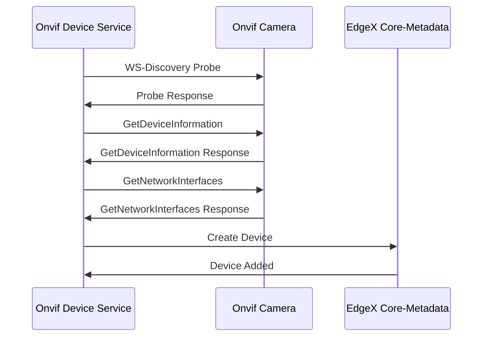
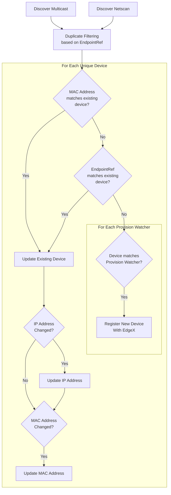

# Auto Discovery
There are two methods that the device service can use to discover and add ONVIF
compliant cameras using WS-Discovery: multicast and netscan.

For more info on how WS-Discovery works, see [here](ws-discovery.md).


## How To
> **NOTE:** Ensure that the cameras are all installed and configured before attempting discovery.

Device discovery is triggered by the device SDK. Once the device service starts, it will discover the Onvif camera(s) at the specified interval.
> **Note:** You can also manually trigger discovery using this command: `curl -X POST http://<service-host>:59984/api/v2/discovery`

### Step 1. Discovery Configuration

> _See [Configuration Section](#Configuration-Guide) for full details_

> **Note:** Alternatively, for `netscan` you can set the `DiscoverySubnets` automatically
> _after_ the service has been deployed by running the [bin/configure-subnets.sh](./utility-scripts.md#configure-subnetssh) script

<details>
<summary><strong>via configuration.toml</strong></summary>

Define the following configurations in [cmd/res/configuration.toml](../cmd/res/configuration.toml) for auto-discovery mechanism:

```toml
[Device]
    [Device.Discovery]
    Enabled = true    # enable device discovery
    Interval = "1h"   # set to desired interval

# Custom configs
[AppCustom]
# The target ethernet interface for multicast discovering
DiscoveryEthernetInterface = "eth0"
# The Secret Path of the default credentials to use for devices
DefaultSecretPath = "credentials001"
# Select which discovery mechanism(s) to use
DiscoveryMode = "both" # netscan, multicast, or both
# List of IPv4 subnets to perform netscan discovery on, in CIDR format (X.X.X.X/Y)
# separated by commas ex: "192.168.1.0/24,10.0.0.0/24"
DiscoverySubnets = "192.168.1.0/24"
```
</details>

<details>
<summary><strong>via Docker / Env Vars</strong></summary>

Define the following environment variables in `docker-compose.yaml`:
```yaml
device-onvif-camera:
  environment:
    DEVICE_DISCOVERY_ENABLED: "true"  # enable device discovery
    DEVICE_DISCOVERY_INTERVAL: "1h"   # set to desired interval

    # The target ethernet interface for multicast discovering
    APPCUSTOM_DISCOVERYETHERNETINTERFACE: "eth0"
    # The Secret Path of the default credentials to use for devices
    APPCUSTOM_DEFAULTSECRETPATH: "credentials001"
    # Select which discovery mechanism(s) to use
    APPCUSTOM_DISCOVERYMODE: "both" # netscan, multicast, or both
    # List of IPv4 subnets to perform netscan discovery on, in CIDR format (X.X.X.X/Y)
    # separated by commas ex: "192.168.1.0/24,10.0.0.0/24"
    APPCUSTOM_DISCOVERYSUBNETS: "192.168.1.0/24"
```
</details>

### Step 2. Set CredentialsMap
See [Credentials Guide](credentials.md) for more information.

## Configuration Guide
### DiscoveryMode
> For docker, set the env var `APPCUSTOM_DISCOVERYMODE`

`DiscoveryMode` allows you to select which discovery mechanism(s) to use. The three options are: `netscan`, `multicast`, and `both`.

#### netscan
`netscan` works by sending unicast UDP [WS-Discovery](./ws-discovery.md) probes to a set of 
IP addresses on the CIDR subnet(s) configured via [`DiscoverySubnets`](#DiscoverySubnets).

For example, if the provided CIDR is `10.0.0.0/24`, it will probe the all IP addresses 
from `10.0.0.1` to `10.0.0.254`. This will result in a total of 254 probes on the network.

This method is a little slower and more network-intensive than multicast WS-Discovery, because it has to 
make individual connections. However, it can reach a much wider set of networks and works 
better behind NATs (such as docker networks).

#### multicast
`multicast` works by sending a single multicast UDP [WS-Discovery](./ws-discovery.md) Probe to the multicast address `239.255.255.250` on port `3702`.
In certain networks this traffic is blocked, and it is also not forwarded across subnets, so it is not compatible with NATs
such as docker networks (except in the case of running an Onvif simulator inside the same docker network).

#### both
This option combines both [netscan](#netscan) and [multicast](#multicast).

### DiscoverySubnets
> For docker, set the env var `APPCUSTOM_DISCOVERYSUBNETS`

This is the list of IPv4 subnets to perform netscan discovery on, in CIDR format (X.X.X.X/Y)
separated by commas ex: "192.168.1.0/24,10.0.0.0/24". This value can be configured automatically via
the [bin/configure-subnets.sh](utility-scripts.md#configure-subnetssh) script.

### DiscoveryEthernetInterface
> For docker, set the env var `APPCUSTOM_DISCOVERYETHERNETINTERFACE`

This is the target Ethernet Interface to use for [multicast](#multicast) discovering. Keep in mind this interface
is relative to the environment it is being run under. For example, when running in docker, those interfaces
are different from your host machine's interfaces.

### ProbeAsyncLimit
> For docker, set the env var `APPCUSTOM_PROBEASYNCLIMIT`

This is the maximum simultaneous network probes when running netscan discovery.

### ProbeTimeoutMillis
> For docker, set the env var `APPCUSTOM_PROBETIMEOUTMILLIS`

This is the maximum amount of milliseconds to wait for each IP probe before timing out.
This will also be the minimum time the discovery process can take.

### MaxDiscoverDurationSeconds
> For docker, set the env var `APPCUSTOM_MAXDISCOVERDURATIONSECONDS`

This is the maximum amount of seconds the discovery process is allowed to run before it will be cancelled.
It is especially important to have this configured in the case of larger subnets such as /16 and /8.


## Adding the Devices to EdgeX


## Rediscovery
The device service is able to rediscover and update devices that have been discovered previously.
Nothing additional is needed to enable this. It will run whenever the discover call is sent, regardless
of whether it is a manual or automated call to discover.

The following logic to determine if the device is already registered or not.



## Troubleshooting

#### netscan discovery was called, but DiscoverySubnets are empty!
This message occurs when you have not configured the `AppCustom.DiscoverySubnets` configuration.
It is required in order to know which subnets to scan for Onvif Cameras.
See [here](#DiscoverySubnets)

#### route ip+net: no such network interface
This message occurs when you have multicast discovery enabled, but `AppCustom.DiscoveryEthernetInterface`
is configured to a network interface that does not exist.
See [here](#DiscoveryEthernetInterface)
